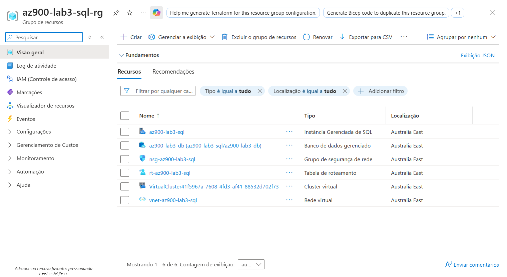

# 🚀 Desafio 3: Instância de Banco de Dados – Bootcamp Microsoft Azure AZ-900

Este repositório contém meu terceiro desafio do bootcamp **Microsoft Azure AZ-900**, oferecido pela **DIO em parceria com a Microsoft**.

O objetivo deste desafio é consolidar os conhecimentos sobre **instâncias gerenciadas de SQL no Azure**.

## BÁSICO
Iniciei acessando minha conta no [Portal Azure](https://portal.azure.com) e navegando até o Azure SQL.

No painel da **Instância Gerenciada de SQL do Azure**, cliquei em **Mostrar opções** e selecionei **Criar Instância Gerenciada de SQL**.

- **Assinatura:** usei minha assinatura ativa no Azure.  
- **Grupo de recursos:** criei um novo grupo chamado `az900-lab3-sql-rg` para organizar os recursos do lab.  
- **Nome da instância gerenciada:** `az900-lab3-sql`, nome fácil de identificar no grupo de recursos.  
- **Região:** escolhi **(Asia Pacific) Australia East**, porque as duas regiões recomendadas inicialmente não tinham disponível o recurso de Instância Gerenciada.  
- **Pertence a um pool de instâncias:** optei por **não usar pool de instâncias**, pois não há pools existentes na minha assinatura.  
- **Computação + armazenamento:** mantive as configurações default, suficientes para fins de estudo.  
- **Método de autenticação:** usei **autenticação SQL**, adequada para testes e fácil de configurar.  
- **Logon de administrador:** criei um usuário personalizado com uma **senha segura**, seguindo boas práticas de segurança.

## REDE
- **Rede virtual/sub-rede:** usei a rede virtual padrão criada automaticamente.  
- **Tipo de conexão:** Padrão.  
- **Ponto de extremidade público:** desabilitado, para evitar exposição à internet pública.

## SEGURANÇA
Mantive os valores padrão, que já oferecem configurações seguras para fins de estudo.

## CONFIGURAÇÕES ADICIONAIS
- **Ordenação:** mantive a ordenação padrão `SQL_Latin1_General_CP1_CI_AS`.  
- **Fuso horário:** mantive o padrão (UTC – Tempo Universal Coordenado).  
- **Replicação geográfica:** não habilitei, pois não é necessária para testes.  
- **Janela de manutenção:** mantive o horário padrão sugerido pelo portal.  

## RÓTULOS
Não criei rótulos (tags) para este lab, mas em produção seriam úteis para organização e controle de custos.

## CRIAÇÃO DA INSTÂNCIA
Revisei todas as configurações na guia **Revisar + criar** e confirmei a criação da instância.  
Acompanhei o progresso da implantação pelo **ícone de notificações** no portal e aguardei a conclusão.

## CRIANDO O BANCO DE DADOS
Após a instância ser provisionada, criei um novo banco de dados:

- **Nome:** `az900_lab3_db`  
- **Fonte de dados:** nenhuma  
- **Outras configurações:** mantidas como padrão do portal  

Ao final, todos os recursos foram revisados e organizados no grupo de recursos. Para evitar cobranças desnecessárias, deletei o grupo de recursos ao final do lab.
